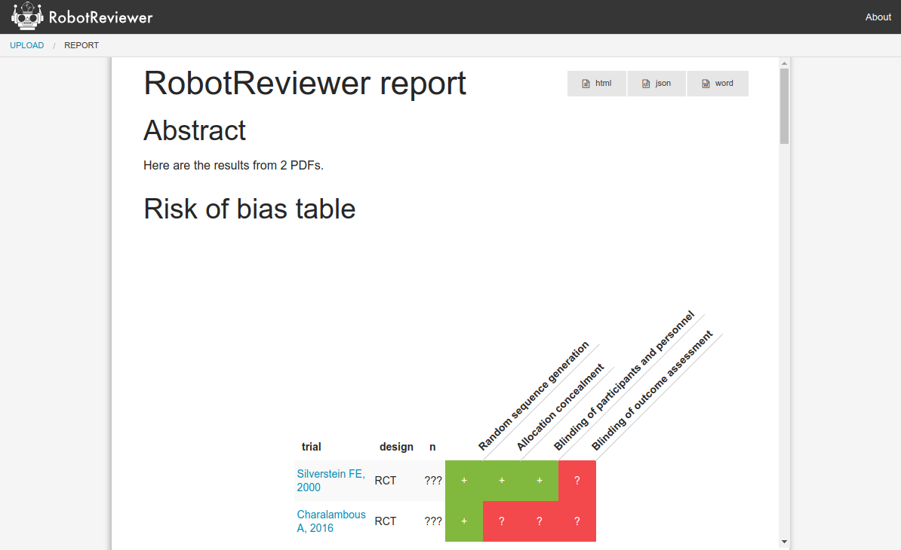

# RobotReviewer
Automatic extraction of data from clinical trial reports

RobotReviewer is a system for providing automatic annotations from clinical trials (in PDF format). Currently, RobotReviewer provides data on the trial *PICO* characteristics (Population, Interventions/Comparators, and Outcomes), and also automatically assesses trials for likely biases using the Cochrane Risk of Bias tool.

You can cite the current version as [](https://zenodo.org/badge/latestdoi/63896496).

We offer RobotReviewer free of charge, but we'd be most grateful if you would cite us if you use it. We're academics, and thrive on links and citations! Getting RobotReviewer widely used and cited helps us obtain the funding to maintain the project and make RobotReviewer better.

It also makes your methods transparent to your readers, and not least we'd love to see where RobotReviewer is used! :)

## The easy way

For most people, we encourage you to use RobotReviewer via [our website](https://robotreviewer.vortext.systems).

No need to install anything, simply upload your PDFs, and RobotReviewer will automatically extract key data and present a summary table.



[RobotReviewer online](https://robotreviewer.vortext.systems)

For those who are particularly technically minded, or have a pressing need to run the software on their own machines, read on...

## Developers of systematic review software?

RobotReviewer is open source and free to use under the GPL license, version 3.0 (see the LICENSE.txt file in this directory).

We'd appreciate it if you would:

1. Display the text, 'Risk of Bias automation by RobotReviewer ([how to cite](http://vortext.systems/robotreviewer))' on the same screen or webpage on which the RobotReviewer results (highlighted text or risk of bias judgements) are displayed.
2. For web-based tools, the text 'how to cite' should link to our website `http://vortext.systems/robotreviewer`
3. For desktop software, you should usually link to the same website. If this is not possible, you may alternately display the text and example citations from the 'How to cite RobotReviewer' section below.

You can cite RobotReviewer as:

Marshall IJ, Kuiper J, Banner E, Wallace BC. “Automating Biomedical Evidence Synthesis: RobotReviewer.” Proceedings of the Conference of the Association for Computational Linguistics (ACL). 2017 (July): 7–12.


A BibTeX entry for LaTeX users is:

@article{RobotReviewer2017,
  title    = "Automating Biomedical Evidence Synthesis: {RobotReviewer}",
  author   = "Marshall, Iain J and Kuiper, Jo{\"e}l and Banner, Edward and
              Wallace, Byron C",
  journal  = "Proceedings of the Conference of the Association for Computational Linguistics (ACL)",
  volume   =  2017,
  pages    = "7--12",
  month    =  jul,
  year     =  2017,
}

## Docker

We maintain a working Dockerfile in the repo, which is usually the easiest way to install locally.

To build and run, from within the code directory run:
```
docker build -t robotreviewer
```

If the build is successful, you can then start the website locally by running:

```
./start.sh
```

You can then access the website on any webbrowser on your local machine at: http://localhost:5050.

To stop the websever, run:
```
docker stop robotreviewer
```


## Installation

1. Ensure you have a working version of Python 3.6. We strongly recommend using Python from the [Anaconda Python distribution](https://www.continuum.io/downloads) for a quicker and more reliable experience.

2. [Install git-lfs](https://git-lfs.github.com/) for managing the model file versions (on Mac: `brew install git-lfs`). NB! If you already have git lfs installed, make sure it's the most recent version, since older versions have not downloaded files properly.

3. Get a copy of the RobotReviewer repo, and go into that directory
    ```bash
    git clone https://github.com/ijmarshall/robotreviewer3.git
    cd robotreviewer3
    ```

4. Install the Python libraries that RobotReviewer needs. The most reliable way is through a conda environment. The following downloads the packages, and installs the required data.
    ```bash
    conda env create -f robotreviewer_env.yml
    source activate robotreviewer
    python -m spacy download en
    python -m nltk.downloader punkt stopwords
    ```

  Install also either tensorflow V 1.12.0, with or without GPU support depending on your preference
  ```bash
  pip install tensorflow==1.12.0 # OR
  pip install tensorflow-gpu==1.12.0
  ```

5. Ensure `keras` is set to use `tensorflow` as its default backend. Steps on how to do this can be found [here](https://keras.io/backend/).

6. This version of RobotReviewer requires Grobid, which in turn uses Java. Follow the instructions [here](https://grobid.readthedocs.io/en/latest/Install-Grobid/) to download and build it. This version of RobotReviewer has been tested with Grobid 0.5.1, but no longer works with 0.4 versions.

7. Create the `robotreviewer/config.json` file and ensure it contains the path to the directory where you have installed Grobid. (RobotReviewer will start it automatically in a subprocess). Note that this should be the path to the entire (parent) Grobid directory, not the bin subfolder. An example of this file is provided in `robotreviewer/config.json.example` (it is only necessary to change the `grobid_path`).

8. Also install `rabbitmq`. This can be [done via homebrew on OS X](https://www.rabbitmq.com/install-homebrew.html), or by alternative means documented [here](https://www.rabbitmq.com/download.html). Finally, install make sure [celery](http://www.celeryproject.org/install/) is installed and on your path. Note that this ships with Anaconda by default and will be found in the `$(anaconda-home)/bin/celery` dir by default.

## Running

RobotReviewer requires a 'worker' process (which does the Machine Learning), and a webserver to be started. Ensure that you are within the conda environment (default name: robotreviewer) when running the following processes.

First, be sure that rabbitmq-server is running. If you haven't set this to start on login, you can invoke manually:

```rabbitmq-server```

Then, to start the Machine Learning worker (using the GPU):

```bash
celery -A robotreviewer.ml_worker worker --loglevel=info --concurrency=1 --pool=solo
```
Alternatively, to start RobotReviewer using CPU only, use the following command:

```bash
env CUDA_VISIBLE_DEVICES=-1 celery -A robotreviewer.ml_worker worker --loglevel=info --concurrency=1 --pool=solo
```

Finally, to start the webserver (on `localhost:5000`):

```bash
python -m robotreviewer
```

**NEW!** To start the server for the Swagger API, run:

```bash
REST_API=true python -m robotreviewer --rest
```


## Demonstration reports

We have included example reports, with open access RCT PDFs to demonstrate RobotReviewer. These are saved in the default database, and can be accessed via the following links.

Decision aids: `http://localhost:5000/#report/Tvg0-pHV2QBsYpJxE2KW-`
Influenza vaccination: `http://localhost:5000/#report/_fzGUEvWAeRsqYSmNQbBq`
Hypertension: `http://localhost:5000/#report/HBkzX1I3Uz_kZEQYeqXJf`


## Rest API

The big change in this version of RobotReviewer is that we now deal with *groups* of clinical trial reports, rather than one at a time. This is to allow RobotReviewer to synthesise the results of multiple trials.

As a consequence, the API has become more sophisticated than previously and we will add further documentation about it here.

In the meantime, the code for the API endpoints can be found in `/robotreviewer/app.py`.

Some things remain simple; e.g., for an example of using RR to classify abstracts as RCTs (or not) see [this gist](https://gist.github.com/bwallace/beebf6d7bbacfbb91704f66c28dcc537).

If you are interested in incorporating RobotReviewer into your own software, please [contact us](mailto:mail@ijmarshall) and we'd be pleased to assist.

## Testing

The following

```bash
python -m unittest
```

will run the testing modules. These should be used to assure that changes made do not break or have an affect on the core of the code. If `Ran X tests in Ys` is displayed, the tests have completed successfully.

## Help

Feel free to contact us at [mail@ijmarshall.com](mailto:mail@ijmarshall) with any questions.

### Common Problems

##### Grobid isn't working properly
Most likely the problem is that your path to Grobid in `robotreviewer/config.json` is incorrect. If your path uses a `~`, try using a path without one.

##### rabbitmq-server: command not found
Often found on OS X. If you installed `rabbitmq` using Homebrew, running the command `brew services start rabbitmq` should work.


## References

1. Marshall, I. J., Kuiper, J., & Wallace, B. C. (2015). RobotReviewer: evaluation of a system for automatically assessing bias in clinical trials. Journal of the American Medical Informatics Association. [[doi]](http://dx.doi.org/10.1093/jamia/ocv044)
2. Zhang Y, Marshall I. J., & Wallace, B. C. (2016) Rationale-Augmented Convolutional Neural Networks for Text Classification. Conference on Empirical Methods on Natural Language Processing. [[preprint]](https://arxiv.org/pdf/1605.04469v2.pdf)
2. Marshall, I., Kuiper, J., & Wallace, B. (2015). Automating Risk of Bias Assessment for Clinical Trials. IEEE Journal of Biomedical and Health Informatics. [[doi]](http://dx.doi.org/10.1109/JBHI.2015.2431314)
3. Kuiper, J., Marshall, I. J., Wallace, B. C., & Swertz, M. A. (2014). Spá: A Web-Based Viewer for Text Mining in Evidence Based Medicine. In Proceedings of the European Conference on Machine Learning and Principles and Practice of Knowledge Discovery in Databases (ECML-PKDD 2014) (Vol. 8726, pp. 452–455). Springer Berlin Heidelberg. [[doi]](http://dx.doi.org/10.1007/978-3-662-44845-8_33)
4. Marshall, I. J., Kuiper, J., & Wallace, B. C. (2014). Automating Risk of Bias Assessment for Clinical Trials. In Proceedings of the ACM Conference on Bioinformatics, Computational Biology, and Health Informatics (ACM-BCB) (pp. 88–95). ACM. [[doi]](http://dx.doi.org/10.1145/2649387.2649406)

Copyright (c) 2018 Iain Marshall, Joël Kuiper, and Byron Wallace

## Support

This work is supported by: National Institutes of Health (NIH) under the National Library of Medicine, grant R01-LM012086-01A1, "Semi-Automating Data Extraction for Systematic Reviews", and by NIH grant 5UH2CA203711-02, "Crowdsourcing Mark-up of the Medical Literature to Support Evidence-Based Medicine and Develop Automated Annotation Capabilities", and the UK Medical Research Council (MRC), through its Skills Development Fellowship program, grant MR/N015185/1
